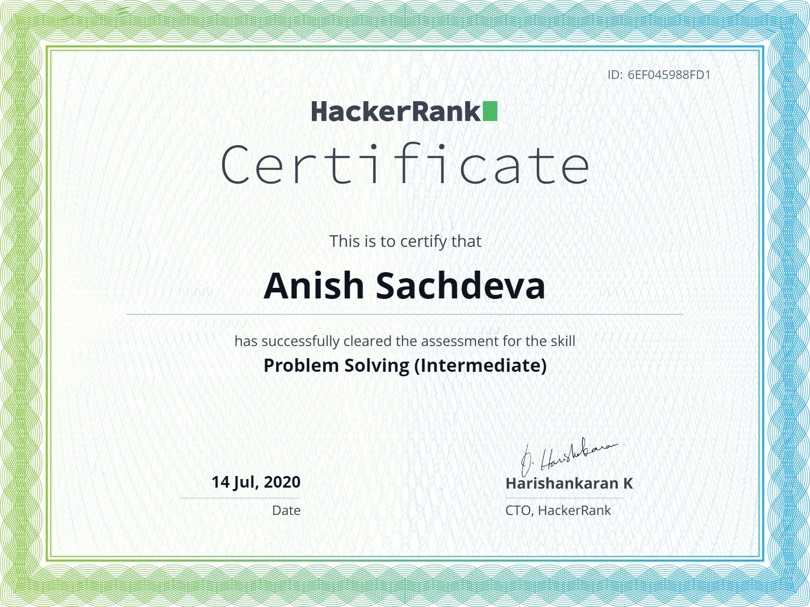

# HackerRank Problem Solving (Basic) Skill Certification Test 

[-1f72ff.svg)](https://github.com/anishLearnsToCode/hackerrank-problem-solving-skill-test)
[-1f72ff.svg)](https://github.com/anishLearnsToCode/hackerrank-js-basic-skill-test)

Took this test on HackerRank [here](https://www.hackerrank.com/skills-verification) 
on __14th July 2020__. 
Certificate can be viewed [here](https://www.hackerrank.com/certificates/6ef045988fd1)

## Programs 
- [GCD SubSequence](src/GCDSubSequence.java)
- [Marketing Strategy](src/MarketingStrategy.java)

## Certificate

